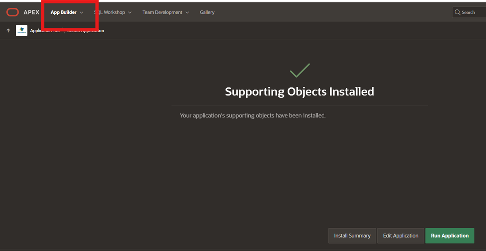
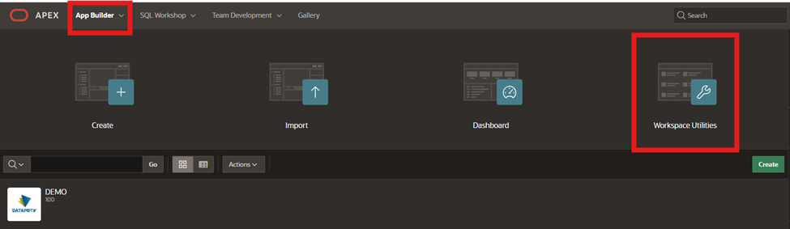
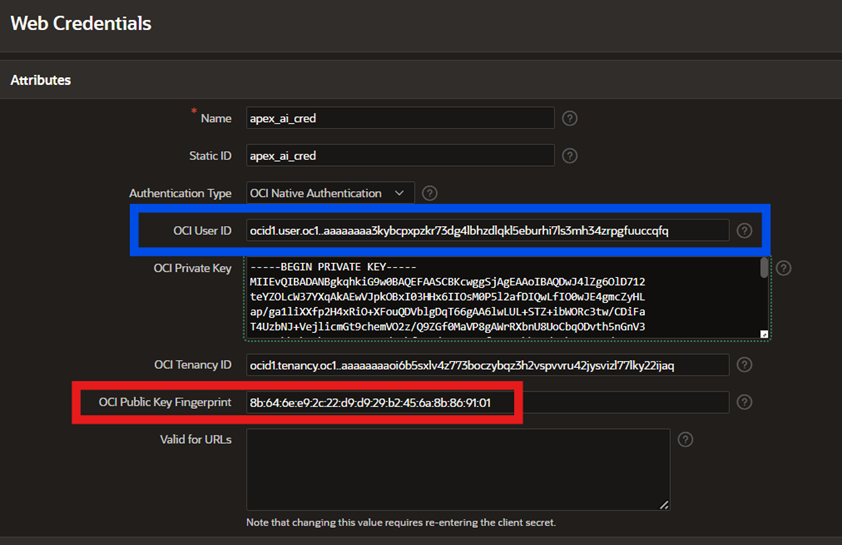
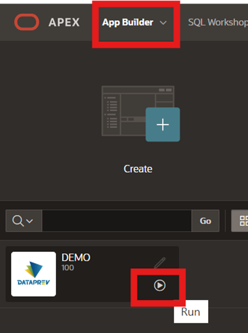
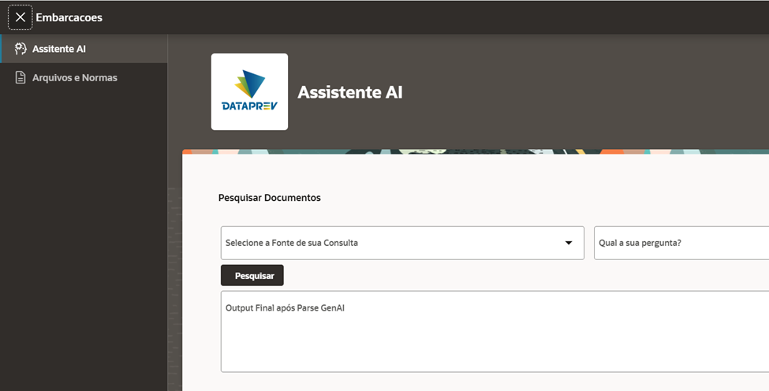
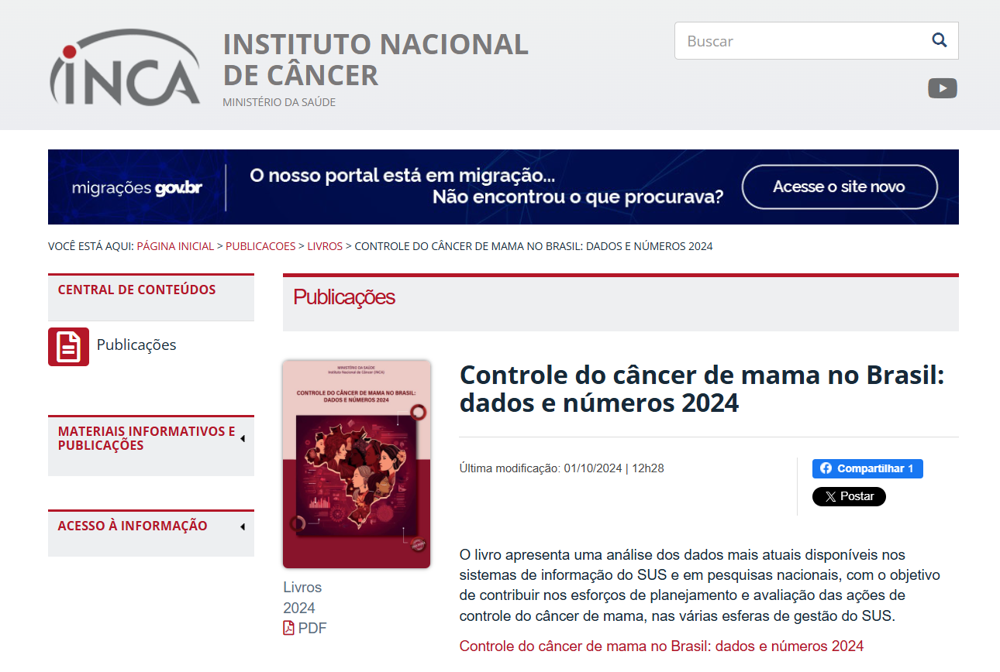
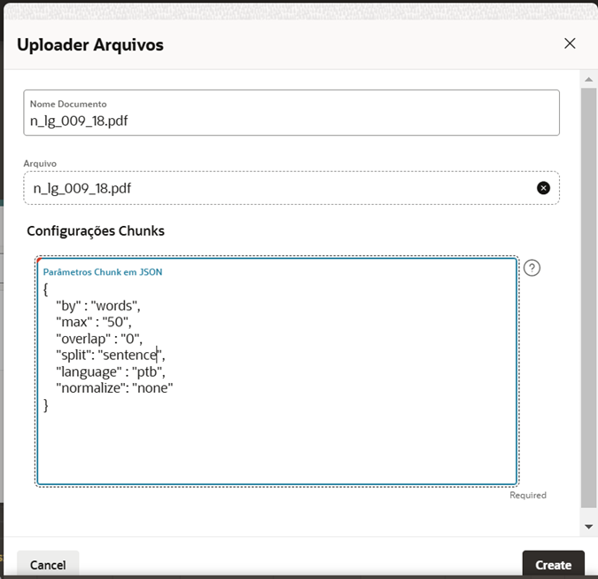
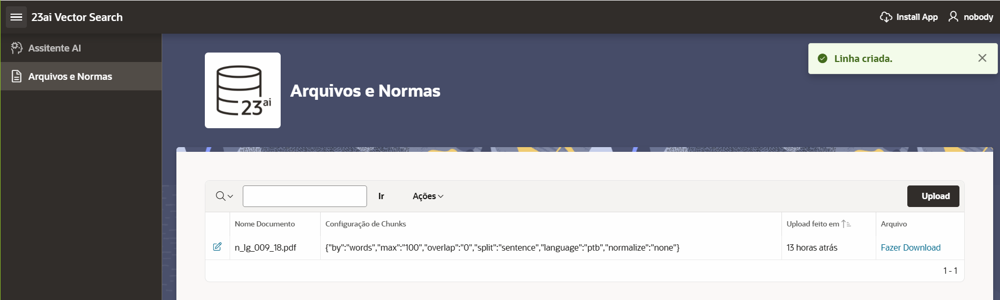
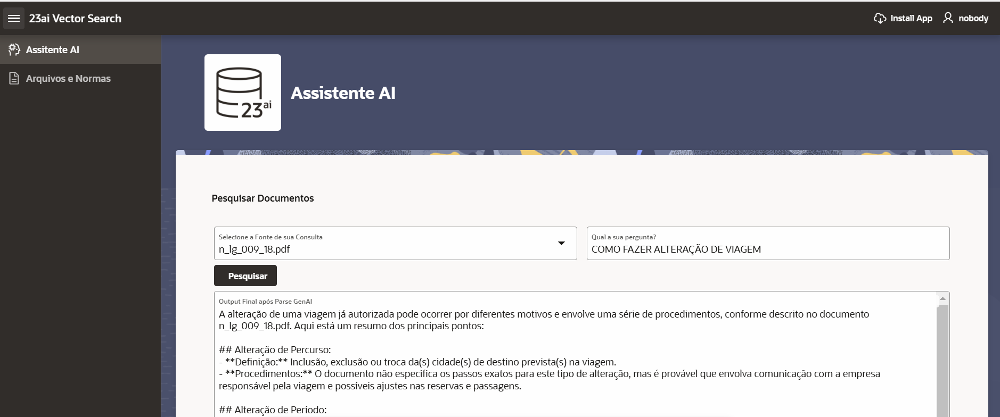

## Oracle APEX

# 🎯 **Objetivos**

  Guiar os participantes na criação e configuração de um ambiente APEX no Oracle Cloud Infrastructure (OCI) para implementar uma aplicação baseada em IA generativa.  

O que você aprenderá:

  - Criar um workspace no APEX.  
  - Importar e instalar uma aplicação.  
  - Ajustar credenciais para integração com serviços do OCI.  
  - Realizar de testes práticos para validar a aplicação. 

### **Recursos e Suporte**:

- **Download dos PDFs**: Neste laboratório utilizaremos dois documentos:
     - [Controle do câncer de mama no Brasil: dados e números 2024](https://www.inca.gov.br/publicacoes/livros/controle-do-cancer-de-mama-no-brasil-dados-e-numeros-2024): Para o nosso exemplo, utilizaremos o arquivo com uma análise dos dados mais atuais disponíveis nos sistemas de informação do SUS.
     - [Cartilha Câncer de Mama](https://accamargo.org.br/sites/default/files/2022/10/cartilha-cancer-de-mama-2022_v15.pdf): Um guia com tudo sobre prevenção, diagnóstico, tratamento e direitos das pacientes
- **Download da Aplicação**: [APEX](https://objectstorage.us-chicago-1.oraclecloud.com/n/idajmumkp9ca/b/embedding-model/o/arquivo_ragproa_apex24.2.sql)
- **Documentação da Oracle Cloud**: [Getting started with vectors in 23ai](https://blogs.oracle.com/coretec/post/getting-started-with-vectors-in-23ai)
- **Tutoriais**: [Oracle Database 23ai - Oracle AI Vector Search & Retrieval Augmented Generation (RAG) with Oracle APEX](https://www.linkedin.com/pulse/oracle-database-23ai-ai-vector-search-retrieval-augmented-rao-bqkcf/)

### _**Aproveite sua experiência na Oracle Cloud!**_

## 📌 Introdução

>**O Oracle APEX (Application Express) é uma plataforma de desenvolvimento low-code que permite a criação rápida e fácil de aplicações seguras, escaláveis e altamente responsivas diretamente no Oracle Database, sem a necessidade de infraestrutura complexa.** 

### ➡️ **Como o Oracle APEX revoluciona o desenvolvimento de aplicações no Oracle Database?**

> Com o Oracle APEX, desenvolvedores podem criar aplicações empresariais modernas por meio de uma interface intuitiva que combina design visual, componentes integrados e funcionalidades avançadas, como gráficos interativos, relatórios dinâmicos e dashboards. O APEX aproveita as capacidades nativas do Oracle Database, como segurança, alta disponibilidade e desempenho, permitindo a criação de workspaces, o upload de aplicações e a integração com serviços externos via credenciais e APIs. Com poucos cliques, é possível importar arquivos SQL, configurar parâmetros de segurança e realizar customizações rápidas e eficientes.

### _**Aproveite sua experiência na Oracle Cloud!**_

## 1️⃣ Criação de Workspace e Import de aplicação em ambiente APEX

Para acessar a URL da instância APEX na Console do Oracle Cloud Infrastructure (OCI), siga os passos a seguir. 

Inicialmente, retorne ao console da OCI. Em seguida, navegue até a página do seu Autonomous Database. Dentro da página da instância do banco de dados, localize e clique na opção **"Tool Configuration"**. Lá, você encontrará a URL da instância APEX. **Copie essa URL e abra em seu navegador.**

   

Na página que será aberta ao acessar a URL da instância APEX, **insira a senha de acesso ao workspace admin**. Recomendamos utilizar a senha **WORKSHOPsec2019##** para este propósito.
 

_VALIDAR -> Indicação de criação da senha WORKSHOPsec2019## deveria ser na etapa de criação do banco mas está aqui._

   

Em seguida, clique na opção **Create Workspace**. Na tela seguinte, escolha a opção **Existing Schema** para continuar com a criação do workspace utilizando um schema já existente.

   

Na sequência, preencha o formulário como o exemplo abaixo (recomendamos a senha **WORKSHOPsec2019##**). E clique em **Create Workspace** para finalizar.

   

Clique na aba superior **Manage Instance** e, em seguida, selecione **Security**.

   

Altere o parâmetro **Allow Public File Upload** para **Yes** e clique em **Apply Changes** para salvar as alterações.

   

Encerre a sessão do usuário **ADMIN** clicando em **Sign Out**, localizado na região superior direita da tela.

   

Faça o login no usuário **DEMO** criado nas etapas anteriores utilizando as credenciais de acesso indicadas abaixo.

   

Clique em **App Builder** e, em seguida, selecione **Import**.

   

Na página que será aberta, faça o upload do arquivo **APEX** utilizando o seguinte link: [APEX](https://objectstorage.us-chicago-1.oraclecloud.com/n/idajmumkp9ca/b/embedding-model/o/workshop_rag_sanca_v2.sql).

   

Aceite as configurações padrão e clique em **Install Application** para prosseguir com a instalação.

   

Clique em **Install Supporting Objects** para concluir a instalação dos objetos de suporte necessários.

   

Por fim, clique na aba **App Builder** para retornar à interface principal de desenvolvimento de aplicações.

   

## 2️⃣ Configuração de Credenciais para RAG (Retrieval-Augmented Generation)

Na aba **App Builder**, clique em **Workspace Utilities** para acessar as ferramentas utilitárias do workspace.

   

Em seguida, selecione **Web Credentials** e clique na credencial existente chamada **apex\_ai\_cred**.

   
   

Para preencher corretamente essa credencial, é necessário obter algumas informações sobre o usuário no ambiente OCI. Na guia do navegador onde o OCI está aberto, clique no avatar no canto superior direito e selecione **User Settings**.

   

Na tela **User Settings**, localize a guia **API Keys** no canto inferior esquerdo. Clique nela e siga as instruções do assistente (wizard) para criar um par de chaves de API. 

> **ATENÇÃO: Certifique-se de salvar as seguintes informações em um local seguro, pois será necessária para configurar a credencial na próxima etapa:**   
> - **OCI User ID**
> - **OCI Private Key**
> - **OCI Public Key Fingerprint**

   

O preenchimento do formulário no APEX exigirá informações específicas que podem ser obtidas na tela do OCI. Para facilitar, **utilize as seguintes correspondências de cores** entre os dois sistemas. Preencha as seguintes informações:
- OCI User ID
- OCI Private Key 
- OCI Public Key Fingerprint

   
   

O OCI Tenancy ID pode ser coletado no OCI na página **Tenancy Details**, que pode ser acessada clicando no nome do seu Tenancy na página inicial do Console ou na seção Tenancy Information dentro de User Settings.

   
   

Retorne à página do APEX e insira o **OCI Tenancy ID** no campo correspondente, utilizando o valor coletado na página Tenancy Details do OCI.

Por fim, clique em **Apply Changes** para salvar as configurações e concluir o ajuste da credencial.

Feito isso, você também precisará atualizar uma última informação do modelo.

Clique em **App Builder** e depois selecione a **Sua Aplicação**.

Selecione a opção **Shared Components**.

Entre na opção **REST Data Sources**.

Abra a REST Source **Cohere-Chat**.

Navegue até a aba **Operation** e **Edite** a única linha disponível.

Busque no seu ambiente OCI por **Compartments** na barra superior, e **Copie o OCID** de um compartimento qualquer.

Inclua o Compartment ID do compartimento do seu ambiente da OCI.

## 3️⃣ Teste da Aplicação

Com a configuração da credencial concluída, podemos testar a aplicação. Para isso, clique em **App Builder** e, em seguida, no ícone **Run** para executar a aplicação e verificar seu funcionamento.

   

Clique em **Arquivos e Normas**.

   

Seguiremos com o upload de um arquivo PDF para dentro da aplicação. Qualquer PDF pode ser utilizado, mas, para fins didáticos deste workshop, recomendamos os seguintes documentos:
- [Controle do câncer de mama no Brasil: dados e números 2024](https://www.inca.gov.br/publicacoes/livros/controle-do-cancer-de-mama-no-brasil-dados-e-numeros-2024)
- [Cartilha Câncer de Mama: Um guia com tudo sobre prevenção, diagnóstico, tratamento e direitos das pacientes](https://accamargo.org.br/sites/default/files/2022/10/cartilha-cancer-de-mama-2022_v15.pdf)

   

Clique em **Upload** e preencha o formulário seguindo o exemplo fornecido. O **JSON** utilizado para o preenchimento está disponível logo abaixo da imagem de referência.

   

    <copy>  

        --JSON Utilizado no preenchimento
    {
        "by" : "words",
        "max" : "100",
        "overlap" : "0",
        "split": "sentence",
        "language" : "ptb",
        "normalize": "none"
    }

    </copy>

Se o upload for concluído com sucesso, sua tela deverá se assemelhar ao exemplo exibido, mostrando a confirmação do arquivo enviado e os detalhes preenchidos no formulário.

   

Clique em Assistente AI e faça uma pergunta relacionada ao documento carregado. Por exemplo, você pode perguntar: **"QUAIS SÃO OS FATORES DE RISCO DO CÂNCER DE MAMA"**.

   

**Se não houver erro, você terá concluído com sucesso o workshop.** Sinta-se à vontade para fazer o upload de outros arquivos ou explorar realizando novas perguntas ao Assistente AI.

# Extra: Personalização Básica de Aplicações Oracle APEX

Este tutorial fornece uma introdução simples à personalização de interfaces em Oracle APEX, focando em elementos visuais como ícones, cores e componentes UI. 

## Índice

- [Introdução](#introdução)
- [Personalizando Ícones](#personalizando-ícones)
- [Alterando Cores](#alterando-cores)
- [Customizando Componentes UI](#customizando-componentes-ui)
- [Recursos Avançados](#recursos-avançados)
- [Certificação em Oracle APEX](#certificação-em-oracle-apex)

## Introdução

Uma interface bem projetada não só atrai visualmente os usuários, mas também melhora a usabilidade da aplicação. Este tutorial cobre os passos básicos para personalizar a sua aplicação APEX, tornando-a mais agradável e funcional.

## Personalizando Ícones

Oracle APEX oferece uma vasta biblioteca de ícones que podem ser utilizados para melhorar visualmente a sua aplicação. Acesse a biblioteca de ícones e escolha os que mais se adaptam às suas necessidades.

**Acessar Biblioteca de Ícones:** [Ícones APEX](https://apex.oracle.com/pls/apex/r/apex_pm/ut/icons)

**Passo a Passo:**
1. Visite o link acima.
2. Navegue pela lista de ícones disponíveis.
3. Copie o código do ícone que deseja usar.
4. Insira o código no local desejado dentro da sua aplicação.

## Alterando Cores

Alterar a paleta de cores é uma maneira eficaz de dar um novo visual à sua aplicação.

**Escolher Paletas de Cores:** [Cores APEX](https://apex.oracle.com/pls/apex/r/apex_pm/ut/colors)

**Passo a Passo:**
1. Acesse o link para ver as cores disponíveis.
2. Escolha uma paleta de cores.
3. Aplique as cores selecionadas através do CSS Customizado na sua aplicação.

## Customizando Componentes UI

Customize componentes como botões, caixas de texto, e menus usando a biblioteca de componentes UI do APEX.

**Explorar Componentes UI:** [Componentes UI APEX](https://apex.oracle.com/pls/apex/r/apex_pm/ut/components)

**Passo a Passo:**
1. Acesse o link e explore os componentes disponíveis.
2. Escolha os componentes que deseja modificar.
3. Siga as instruções para aplicar as modificações na sua aplicação.

## Recursos Avançados

Para usuários que desejam explorar funcionalidades mais avançadas:

**Componentes Avançados:** [Componentes Detalhados](https://apexrw-dev.apexdev.oraclecorp.com/ords/r/redwood/redwood-apex-library/components?session=12200202141555)
**Recursos Adicionais:** [Recursos APEX](https://apexrw-dev.apexdev.oraclecorp.com/ords/r/redwood/redwood-apex-library/resources?session=5251767119431)

## Certificação em Oracle APEX

Fortaleça suas habilidades e obtenha reconhecimento oficial através da certificação em Oracle APEX.

**Curso e Certificação:** [Oracle APEX Foundations](https://mylearn.oracle.com/ou/learning-path/oracle-apex-foundations/112444)

Este é apenas o começo! Explore as referências fornecidas para descobrir mais sobre como você pode personalizar sua aplicação Oracle APEX e torná-la única.

## 👥 Agradecimentos

- **Autores** - Caio Oliveira
- **Autores Contribuintes** - Isabelle Anjos, Gabriela Miyazima, Aristotelles Serra
- **Última Atualização Por/Data** - Janeiro 2025

## 🛡️ Declaração de Porto Seguro (Safe Harbor)

O tutorial apresentado tem como objetivo traçar a orientação dos nossos produtos em geral. É destinado somente a fins informativos e não pode ser incorporado a um contrato. Ele não representa um compromisso de entrega de qualquer tipo de material, código ou funcionalidade e não deve ser considerado em decisões de compra. O desenvolvimento, a liberação, a data de disponibilidade e a precificação de quaisquer funcionalidades ou recursos descritos para produtos da Oracle estão sujeitos a mudanças e são de critério exclusivo da Oracle Corporation.

Esta é a tradução de uma apresentação em inglês preparada para a sede da Oracle nos Estados Unidos. A tradução é realizada como cortesia e não está isenta de erros. Os recursos e funcionalidades podem não estar disponíveis em todos os países e idiomas. Caso tenha dúvidas, entre em contato com o representante de vendas da Oracle. 
